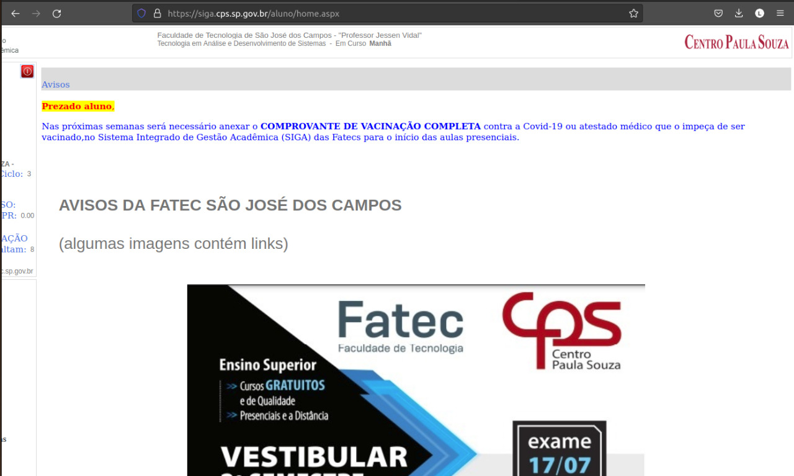
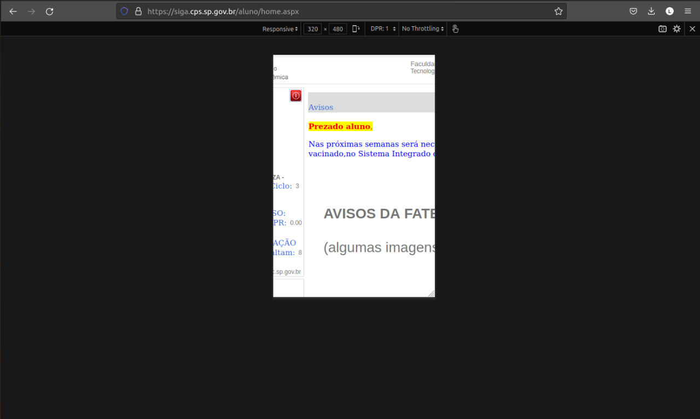

Usando como base os tópicos descritos no site da [WCAG/W3C](https://www.w3.org/WAI/WCAG21/quickref/) cito aqui exemplos e contra-exemplos de cada heurística

# AVALIAÇÃO HEURISTICA
  # 1 - Perceivable
  ## 1.1 Text alternatives
  Alternativas de texto são para qualquer conteúdo que não seja de texto para que possa ser alterado para outras formas que as pessoas precisem, como letras grandes, brailes, descrição de imagem, etc.
  
  ### Exemplo de boa utilização:
  Neste exemplo possui, mesmo que pouca coisa, uma descrição identificando o anime da imagem na tag alt.
  

  
  ### Contra exemplo:
  Por outro lado, nesse outro site não encontramos nenhuma descrição.
  

    
  ## 1.2 Time-based Media
  ## 1.2.2 Captions (Prerecorded) - Level A
  Legenda são requeridas para todos os videos pre-gravados contendo sincronização de mídia, exceto quando a mídia é uma mídia alternativa para texto e sendo claramente uma "label". 
  ### Exemplo de boa utilização:
  Neste exemplo, temos o youtube como bom exemplo e podemos ver que o vídeo está em outro idioma (inglês) e dispõem de legenda para conseguirmos entender melhor o que estão falando durante o vídeo.
  
  ### Contra exemplo:
  Por outro lado, temos o instagram em que nem todos os video são legendados, como este vídeo em outro idioma (japonês) e não possui nenhum tipo de mídia alternativa como legenda para entendermos o que estão falando no vídeo.
  

  ## 1.3 Adaptable
  ## 1.3.4 Orientation - Level AA
  Para melhor experiência de todo tipo de usuário, criar um ambiente em que seja compatível com uma tela pequena, sendo um celular, tablet, etc... até mesmo um computador com mais espaço na tela.
  ### Exemplo de boa utilização:
  Um ótimo exemplo de adaptação mobile e desktop é o instagram, como podemos ver a seguir, o site possui tanto suporte para celulares quanto para computadores:
  ## Versão Desktop
  
  
  ## Versão Mobile
  

  ### Contra exemplo:
  Como mal exemplo de compatibilidade temos o SIGA, que quando no modo desktop as informações aparecem de tamanho normal, mas quando em modo mobile aparece grande demais para usuários usando um smartphone.
  
  ## Versão Desktop
  
  
  ## Versão Mobile
  

  
  ## 1.4 Distinguishable
  ## 1.4.2 Audio Control - Level A
  Se algum áudio na Web tocar por mais de 3 segundos, deverá ter disponível um mecanismo para pausar e dar play no áudio, ou um mecanismo para controlar o volume do áudio de maneira separada do volume geral do sistema.
  
  ### Exemplo de boa utilização:
  A seguir podemos ver um bom exemplo de controle de ádio no YouTube:
  
  
  ### Contra exemplo:
  Agora um mal exemplo de controle de áudio é o instagram, temos apenas a opção de tirar o som do vídeo, não tendo controle nenhum do volume do áudio:
  

  # 2 - Operable  
  ## 2.1 Keyboard Accessible - Level A
  Transforme todas as funcionalidades acessíveis por meio do teclado.

  ### Exemplo de boa utilização:
  Um exemplo de software que utiliza isso é o Word. Ao apertar a tecla alt no programa é apresentado as teclas para mudar para cada aba ou para realizar qualquer funcionalidade possível (mudar fonte do texto, deixar em negrito, mudar alinhamento do texto etc.):

  

  ### 2.4 Navigable - Level A 
  Navegar pelo site de forma precisa e fazendo com que o usuário consiga encontrar o que ele precisa, é essencial para sua experiência de uso.

  ### Exemplo:
  omo exemplo de um site que é possível uma navegação bem interessante é o Wikipedia. Além de separar cada parte do conteúdo em títulos e subtítulos, podemos navegar tranquilamente pelo indíce após a introdução do conteúdo.

  

  ## 3. Understable
  ## 3.1 Readable - Level A
  O conteúdo deve ser legível e compreensível para qualquer pessoa para melhor experiência.

### Exemplo:
No site de G1, como ele é de notícias, ou seja, utiliza-se bastante da linguagem verbal, é interessante que seja legível e compreensível seu texto. Nesse caso, ele utiliza letras do tamanho interessante para leitura:

  ### Contraexemplo:
  As letras utilizadas no site do Siga, no menu e em alguns locais de texto, possui letras muito pequenas, o que dificulta na leitura e para encontrar informações que o usuário precisa:

  

  ### 3.2 Predictable:
  As páginas Webs devem ser intuitivas e previsível pelo usuário.

  ### Exemplo:
  No site de vídeos Youtube, é fácil para o usuário saber, por exemplo, o que cada opção de reprodução de vídeo faz (pausar, volume, configurações, legendas etc.), se o vídeos está carregando (com um circulo rodando) ou, então, quanto tempo de vídeo já foi carregado (cinza mais claro):

  

#### Contraexemplo:

## ⚙️ WCAG Levels
WCAG uses three levels to distinguish the extent of compliance with WCAG 2.1, these levels being A, AA and finally AAA. This is what they represent:

A – Lowest level of compliancy.

AA – Moderate level of compliancy and the most popular level.

AAA – Full compliancy, although not many websites achieve this level as it is sometimes simply not possible to adhere to every single rule with some content.
     
